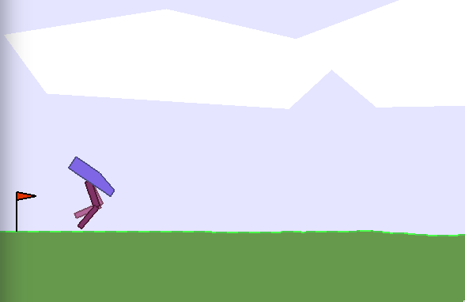

# OpenAI gym GUI


The OpenAI gym GUI in this package is used to control the PPO reinforcement learning algorithm, set up the neural networks and the reinforcement learning parameters to solve various RL environments. 

To run it:

```
python rl/algorithms/Interface.py
```

Interface guidelines:
1. Create environment - initializes the agent in an environment specified by the dropdown menu with the neural network architecture configured in the 'Network' table.
2. Train - the agent runs the environment on an episode basis (until it exceeds the time limit / achieves the goal or fails in some critical way). While training you are shown only the last frame of the episode and the neural networks are updated every *n* episodes as indicated by the parameter *batch_size*. You can see plots for average reward per batch and the loss of the policy network on the left.
3. Test - runs the current policy of an agent in the environment step-by-step. The bottom left plot shows the output of the Actor (policy network). You can pause the training at any time and use this mode to check what your agent is doing exactly during the episode inbetween the updates.
4. Reset - destroys the agent and lets you rerun it with a different architecture or create a different environment.
5. Record - when the 'Test' mode is on you can record the policies of your agents and output .gif files to the current directory. Only works with *OpenAI gym* environments.
   
Apart from the neural net architectures the other parameters of the environments can be changed during runtime, therefore you can experiment to achieve better performance (or worse). Each parameter has a tooltip that explains its use and the general guidelines of how they should be configured depending on the complexity of the problem.

## 1. Solving the MountainCarContinuous-v0 environment.


This *OpenAI gym* environment is a great illustration of a simple reinforcement learning problem where the agent has to take detrimental actions that give negative rewards in the short term in order to get a big reward for completing the task (a primitive form of planning). It has a very simple state and action space: 1 action [-1:1] indicating the velocity to left or right, and a state constisting of a vector: [position, velocity]. As the agent moves towards the goal (flagpole) it receives positive reward, as it moves away from it - negative. The car does not have enough torque to just go uphill straight away, therefore it needs to perform a swinging action first.

**Given the right parameters the environment can be solved in 1-2 network updates.**

Hints: 
1. The problem is very simple, therefore the neural networks required should be small (couple of hiden layers with ~10 units each are sufficient).
2. Read the tooltips of parameters to guide you.
3. If the output of the agent is in the range [-1:1] what is the required activation function for the actor network? Tanh/linear/sigmoid? (Look up the functions online if you are not sure.)

## 2. Solving the BipedalWalker-v2 environment.



This *OpenAI gym* environment shows a slightly more complicated agent with 4 degrees of freedom (4 actions) and a state that represents the velocities of the torso and motors as well as a simple lidar to see the terrain ahead of the agent. The state is described by a vector of length 24:

|                        |      |     |     |     |
| ---------------------- | ---- | --- | --- | --- |
| Motor angles:          | (4)  |
| Motor torques:         | (4)  |
| Lidar points:          | (12) |
| Torso velocity:        | (2)  |
| Torso angle            | (1)  |
| Torso angular velocity | (1)  |

Hints:
1. When the action and state spaces grow, you need to increase the sizes of hidden layers.
2. Generally, 2/3 hidden layers are enough to solve control problems.
3. Learning rates should decrease as complexity increases.
