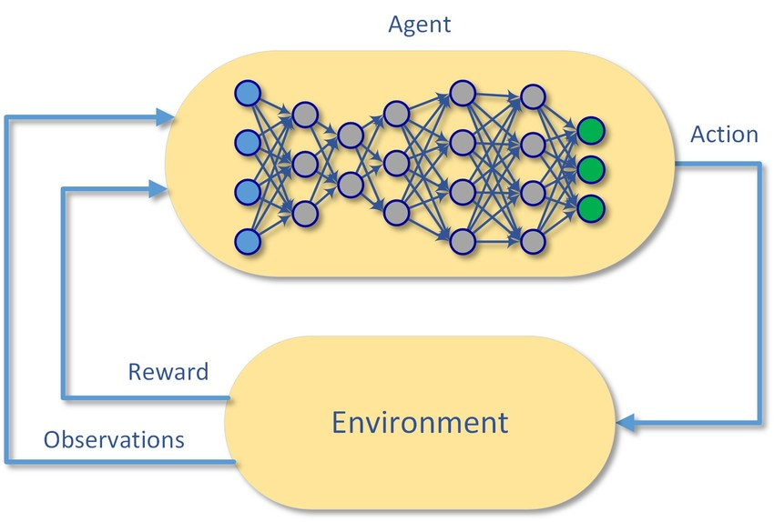

# How to create custom reinforcement learning environments and train agents

This guide will explain how to create your custom reinforcement learning environments using Python in a manner that is widely used by the community. This will ensure that your environment class is compatible with most of the algorithm implementations that can be found online. In addition this guide contains instructions on how to use the stable-baselines reinforcement learning library - a fork which extends the functionality of baselines by OpenAI.

Contents:
1. **Creating your custom reinforcement learning environments**
   
    - Using OpenAI gym as a base for your environment
    - Required methods and attributes
  
2. **Software setup**
   
   1. Python dependencies
   2. Additional software packages

3. **Using the custom extension for stable-baselines**
   1. Introduction
   2. Enabling your custom environment classes
   3. Configuration file structure
   4. Simple environment example
   5. Scripts for training and testing models


---
---
---
## 1. Creating your custom reinforcement learning environment
 

Reinforcement learning is a framework for learning sequences of optimal actions. The main goal is to maximize the cumulative reward that the agent receives over multiple timesteps.​
The main concept in reinforcement learning is called Markov Decision Process (MDP):
Here are some of the main components of MDPs in and how they relate to your code structure.
- **Agent** - the combination of neural network(s) and the RL algorithm. The NN receives the current state of the environment as input while the output layer determines which action is taken. The RL algorithm collects batches of experiences generates gradients for the network updates based on the reward received.
- **Environment** - an object that the agent interacts with through actions. It provides the agent with observations, rewards and contains all the logic for state transitions.
- **Observation** - current description of the environment's state in some form (vector / image, determines the size on the NN input).
- **Actions** - a set of distinct ways that the agent can interact with the environment (determines the size of the NN output). Can either do regression (continuous actions - [e.g. turn 27.2 degrees]) or be used with softmax to select a single discrete action [e.g. turn left].
- **Rewards** - a scalar value that the environment provides to the agent to differentiate between good/bad actions. Usually its a composite of multiple reward criteria that all get summed up into a single scalar.
- **Episode** - a set of [state0-action0-state1-action1-...state_n,action_n] transitions performed by the agent until a termination condition. Termination could be any event (e.g. exceeding the time limit, achieving the goal or failing at the task in some way). After the end of episode the environment is reset to its initial conditions.


---
## 1. Using OpenAI gym.Env class as a base for your custom learning environment

 

You can make your custom RL environment compatible with the vast majority of RL libraries and/or RL algorithm implementations that are available online by inheriting from the gym.Env superclass. This will provide you with several methods and class attributes that are very helpful in defining the MDP of your environment. If your environment is designed the right way then it only needs two methods that the agent (RL model/algorithm) will use to interact with it.

1. **Create the environment subclass:**

```python
import gym

class CustomEnvironment(gym.Env):
	def __init__(self, config=None, **kwargs):
		super(CustomEnvironment, self).__init__()
				self.config = config
		self.action_space = ... (1)
		self.observation_space = ... (2)

	def reset(self):  (3)
		return ...

	def step(self, action): (4)
		return ...

	def render():
		return ... (5)
```

Detailed descriptions of these attributes and methods are described below.

2. **Define the action and state spaces in the constructor of your class (these will determine the sizes of your NN input/output layers, the expected value ranges and data types):**


   
   1. **Action space** - how many distinct actions can your agent take to interact with the environment? Are they continuous/discrete? What expected ranges do they have? 

```python
# Continuous action space (10 actions that have the values ranging [0:1] and are executed simultaneously at every step of the MDP).
self.action_space = gym.spaces.Box(low=0, high=1, shape=(10), dtype=np.float32) 

# Discrete action space - makes the algorithm perform a single discrete action (e.g. turn right OR turn left). 

self.action_space = gym.spaces.Discrete(4)  # 4 discrete unique actions. The action that your network produces in this case will be an integer [0, 1, 2, 3].
```

   2. **Observation space** - how does the agent perceive the current state of the environment? Is it an image or a vector of feature? Are the values discrete or continuous? This will also determine the type of neural network that will need to be used for the agent and the size its input layer.

```python
# Your observation is an 64x64 RGB image:
self.observation_space = gym.spaces.Box(low=0, high=255, shape=(64, 64, 3), dtype=np.uint8)

# Your observation is a vector of length 10, with values ranging [0:1]
self.observation_space = gym.spaces.Box(low=1, high=1, shape=(10), dtype=np.float32) 
```

3. **Define the following methods:**
   
    The methods reset() and step() must be defined in order to run the MDP loop in your environment. Most of the RL algorithm implementations take an instance of your environment class and repeatedly call these two methods to get observation, reward and action tuples that are then used to train your model.
   1.  **reset()** - this method gets called when initializing the environment and every time an episode ends (termination condition is reached). Takes no arguments, returns the current state (image or a vector) with the same dimensions and value bounds as defined in self.observation_space. 

```python
def reset(self):
    """
    Resets the state of the environment and returns an initial observation.
    Returns:
        observation (object): the initial observation.
    """
    state = self.get_state() # Your custom method for obtaining the state

    return state
```

   2. **step(action)** - performs a single step in the MDP of your environment. Given an action as input the method returns a tuple of (1) current state, (2) reward, (3) a boolean of whether the episode is done and (4) a step summary (can be just an empty dictionary {})

```python
def step(self, action):
    """
    Run one timestep of the environment's dynamics. When end of
    episode is reached, you are responsible for calling `reset()`
    to reset this environment's state.
    Accepts an action and returns a tuple (observation, reward, done, info).
    Args:
        action (object): an action provided by the agent
    Returns:
        observation (object): agent's observation of the current environment
        reward (float) : amount of reward returned after previous action
        done (bool): whether the episode has ended, in which case further step() calls will return undefined results
        info (dict): contains auxiliary diagnostic information (helpful for debugging, and sometimes learning)
    """
    state  = self.get_state(action)     # Custom logic to obtain a new state of the environment based on the action
    reward = self.get_reward()          # Calculate the rewards based on state and action
    done   = self.check_termination()   # Check whether the episode should terminate and the environment should be reset to the initial state.
    info   = {}

    return state, reward, done, info
```

   3. **render()** - a not strictly necessary method that should return an image that shows the state of your environment. Used for visualization

```python
def render(self):
    """
	Returns an RGB image of your environment.
	"""
	return self.get_image()
```

You can find an example of such an environment in [rl/environments/testEnv.py](https://github.com/andriusbern/RL/blob/master/rl/environments/testEnv.py) which is also described in more detail in **Section 3**. 


---

## 2. Software setup

|  | 
|:--:| 
| [*Stable-baselines*](https://github.com/hill-a/stable-baselines) |


When designing a reinforcement learning solution for a specific problem you might face a trade-off between using a RL library, or implementing the algorithms yourself. Using your own implementations will provide you with more flexibility and control but it will increase the development time substantially as well as restrict some of the design choices. 
Usually creating a successful RL solutions requires you to go through numerous reiterations of the environment and reward functions and that can be very time consuming (highly recommended blog-post). Using a RL library will allow you to test different RL algorithms, network types (MLP/CNN/RNN) and different kinds of state and action spaces. 

This section provides instructions on how to set up everything you need to run the [stable-baselines](https://github.com/hill-a/stable-baselines). Requirements:

1. Install Microsoft MPI (Message Passing Interface) - used for coordinating the parallel agents during training.
2. Install Python packages:
   
    **Core dependencies:**

    1. [stable-baselines](https://github.com/hill-a/stable-baselines) - if using a Windows machine, follow the instructions [here](https://stable-baselines.readthedocs.io/en/master/guide/install.html#windows-10).
    2. tensorflow or tensorflow-gpu
    3. [gym](https://gym.openai.com/)
    4. opencv-python 

--- 

**Optional dependencies** (to simplify model training using stable-baselines reinforcement learning library):
 1. RL: a custom reinforcement learning package (can be found in the [repository](https://github.com/andriusbern/RL)) that contains:
      - A wrapper class for stable-baselines that simplifies model training.
      - Custom policy neural networks.
      - Configuration file templates.
      - Training and testing scripts for models/environments.
  
 *If you choose to use the **RL** option, all the dependencies can be installed by setting up the RL package ([instructions](https://github.com/andriusbern/RL)). The details of how to use this package are summarized in the sections below.

---


---
# 3. Using the *RL* package to run environments and train agents

## 1. Introduction

This package will provide you with the functionality to easily configure, train, save, load and test your RL models. This package can be used with your custom environments as well as any gym-based environment (look up [gym](https://gym.openai.com/envs/), [pybullet-gym](https://github.com/benelot/pybullet-gym), [robotics](https://github.com/araffin/robotics-rl-srl), [roboschool](https://github.com/openai/roboschool)).

```python
from RL import Trainer

model = Trainer('ENV_NAME').create_model() # ENV_NAME -> the name of the class of your environment
model.train()                              # Train the model as specified in the configuration file and save it in a unique directory   ../RL/trained_models/{ENV_NAME}/{unique_model_id}/*
model.run()								   # Run the trained model

del model
reloaded = Trainer('ENV_NAME').load_model(latest=True) # OR reloaded = Trainer('ENV_NAME').load_model(num=0), where num is the unique numerical identifier of your trained model
reloaded.run()
```

If you designed your environment in the way described in section 1 then you can use almost any RL algorithm implementation that you can find or make one of your own. Therefore you can choose to use this if you want to save some time or do some testing to find viable model/algorithm alternatives.
As your options increase it becomes hard to keep track of what kind of configuration was used to train a specific model. Therefore it is somewhat mandatory have some kind of configuration setup for instantiating and reloading your models even after changes to the code were made.

This package has the following folder structure:

```
rl/...
...baselines/       # Wrapper class for stable baselines and custom policies
...config/          # Storing environment-specific configuration files
...environments/    # For storing custom environments
...trained_models/  # For storing trained models, configurations, logs
setup.py            # Installation file

```

---

## 2. Enabling your custom environments

Requirements for creating and training a new custom environment when using the ***rl*** package:
   1. A file containing your custom environment class inside *../rl/environments* created using the guidelines listed in Section 1.
   2. An import statement for that class inside *../rl/environments/__init__.py* as follows:
   
        ```python
        from .FileContainingMyCustomClass import CustomEnvironmentClass
        ```
   3. A configuration file with the same name as your environment class inside *../RL/config/CustomEnvironmentClass.yml.* This file will contain all the relevant configurations that your environment and model might use. This configuration is explained in detail below. You can copy the default parameters in from rl/config/default.yml when creating a new config file.

---

## 2. Configuration file explanation

This implementation uses .yml file extension to configure all the relevant parameters:
- RL model hyperparameters
- Neural network architectures
- Learning environment parameters
- Training parameters and parallelization
- Logging
  
The reason for using these configuration files is that once you have too many hyperparameters it becomes very hard to tune your environment your RL model and the policies concurrently and logging the progress. Using this setup you can have many different versions of your custom environment (given that it is configured in a specific way, more details below). This configuration ensures that the trained RL models will be loaded with the same parameters and in the same iteration of the environment as they were trained on. 

[More information on YAML file format.](https://docs.ansible.com/ansible/latest/reference_appendices/YAMLSyntax.html)

You can find all the default parameters for the algorithms and policies in *rl/config/rl.yml*.


### **1. Main**
   
 

This section contains the main training parameters.

Arguments:

   - **model**: RL model to use (PPO2, ACER, ACKTR, DQN, A2C). The hyperparameters of the corresponding algorithm can to be configured in the models section of this configuration file. 
   - **normalize**: whether to normalize the state inputs and rewards based on running mean. Try experimenting with this or implement normalization in your environment.
   - **policy**: the type of neural network architecture to use. Can be either the default policies provided by stable-baselines or the custom policies (CustomMlpPolicy, CustomCnnPolicy, CustomDQNPolicy, CustomLstmPolicy).
   More information on how to configure the custom policies in the policies section below.
   - **logs**: a tensorboard log will be created for the specified class attribute(s) of your environment. It is very useful when the reward that your agent is getting is not necessarily the metric that you are really interested in. In this example self.steps attribute of the TestEnv class will be logged and showed along other graphs in tensorboard and we can see how quickly the agent reaches its goal as the training progresses. You can define as many of these logs as you desire as long as they are class attributes of your environment.

### **2. Models**
   
Depending on the model selected in the main section, use this to configure the hyperparameters for the reinforcement learning model. More details can be found at [stable-baselines documentation](https://stable-baselines.readthedocs.io/en/master/guide/algos.html):

### **3. Policies**

This section shows how to configure the sizes of the custom neural networks that can be used with the reinforcement learning models:
- CustomCnnPolicy: used for image-based state spaces.
  - filters: number of convolutional filters to use per layer. Each new line with "- n" will create an additional layer.
  - kernel_size: size of the kernels to use per layer.
  - strides: the stride size to use per layer.
  - shared: number of nodes per fully connected layer in the shared part of the MLP network.
  - h_actor: number of nodes per layer in the actor (policy) head of the network.
  - h_critic: number of nodes per layer in the critic (value) head of the network.

- CustomMlpPolicy: (used for vector based state spaces)
  - shared: number of nodes per fully connected layer in the shared part of the MLP network.
  - h_actor: number of nodes per layer in the actor (policy) head of the network.
  - h_critic: number of nodes per layer in the critic (value) head of the network.

- CustomDQNPolicy: (used for DQN only)
  - layers: number layers and number of nodes per layer

- CustomLstmPolicy: Insert LSTM cells before the shared layer of the MLP. Drastically increases training time.
  - n_lstm: number of LSTM cells to use.
  - other: same as CustomMlpPolicy
  
### **4. Environment**


     A copy of the parameters will also be passed to the constructor of your environment class, therefore you can refer to the variables defined in the configuration file inside your environment code. Look up the ../rl/environments/TestEnv.py along with ../rl/config/TestEnv.yml to see how this is achieved. 

---

## 3. A minimalistic custom environment

 

Here is the code for the most simple RL environment possible designed by using the same instructions as in Section 1. This environment consists of a NxN grid in which the agent (grey) should reach the target (white) through actions (go right/left/up/down).


You can run this environment by:
```
python environments\testEnv.py
```

You can also change the parameters in the configuration ../rl/config/TestEnv.yml file to change some of the parameters of the environment and the models/policies.

**States:** To solve this kind of environment you could both use the NxN grayscale image of the grid or a vector containing the X, Y coordinates of the agent and the target (using either a CNN or an MLP based agent respectively). Examples of state spaces for both of these scenarios can be found in the ..rl/environments/testEnv.py file.


**Rewards:** The agent receives a negative reward for every step it takes and a positive reward once it reaches its target. However to make the training process faster and more reliable we can introduce reward shaping - include the euclidean distance between the agent and the target as a reward.

---

## 4. Scripts for training and testing your models

You can pass a -h flag to any of these scripts to see a detailed description of CL arguments.

- train.py  - trains a RL agent in the specified environment using configuration corresponding to the environment name. Will save the model under *../rl/trained_models/ENV_NAME/subdir/model/*
    - example: train.py --env TestEnv --subdir TestDirectory --name FirstModel
    - example: train.py --env MountainCarContinuous-v0 --subdir gymTest             (will use ../config/gym.yml file)
  
- retrain.py  - continues training a model in case you want to train more or it stopped unexpectedly.
    - example: retrain.py --env TestEnv --subdir TestDirectory --num 0
    - example: retrain.py --env MountainCarContinuous-v0 --subdir gymTest --num 0
  
- test.py - tests a trained RL model
    - example: test.py --env TestEnv --subdir TestDirectory --num 0 --render
    - example: test.py --env MountainCarContinuous-v0 --subdir gymTest --num 0 --render
  
- scheduler.py - for scheduling long training runs of multiple models using the contents of a folder with configuration files in ../rl/config/{Name}/*.yml
  - example: scheduler.py --env MountainCarContinuous-v0 --result_folder ResultDirectory --parameter_folder Experiment


